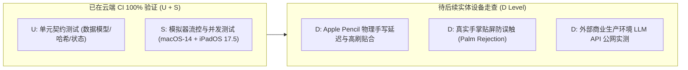

# M2 阶段正式收口与交接文档 (M2-CLOSE-pm-002)

- 文件编号：`M2-CLOSE-pm-002`
- 报告时间：`2026-09-08T09:17:30+08:00`
- 发送角色：项目经理（Claude1）
- 接收角色：主协调者（parent）、项目后端（Codex1）、项目测试（Codex2）、外部 UI 总监（Claude2）
- 代码提交基线：Commit `c429470`
- 依据规范与基线：
  - 原始产品需求：`docs/product/PRD-v0.1-source.md`
  - 项目规划与看板：`docs/project/PLAN.md`、`docs/project/BOARD.md`
  - M2 收口检查表：`docs/project/M2-CLOSE-CHECKLIST.md`
  - 后端契约规范：`docs/backend/CONTRACT-v0.1-draft.md` (修订标识：`0.1-draft / M0-BE-REV2`)
  - UI 架构与适配器规范：`docs/ui/READER-ADAPTER-SPEC.md` (版本：`v0.3-aligned-be-rev2`)
  - QA 云端流水线验收报告：`docs/qa/M2-VERIFICATION-REPORT.md` (编号：`M2-VERIFY-REPORT-001`)
  - QA 收口交接文档：`docs/handoffs/M2-QA-CLOSE-qa-001.md`
- 独占维护与变更路径：
  - `docs/project/BOARD.md` (M2 各任务及总体状态更新为 DONE，发布 M3 READY 规划)
  - `docs/project/PLAN.md` (M2 更新为 CLOSED，M3 更新为 READY)
  - `docs/project/M2-CLOSE-CHECKLIST.md` (全项闭环审计)
  - `docs/logs/pm.md` (记录系统时间戳与工作日志)
  - `docs/handoffs/M2-CLOSE-pm-002.md` (本文件)

---

## 1. M2 阶段收口核心结论

### 1.1 GitHub Actions CI 真实云端流水线验收全量通过
根据测试负责人 Codex2 提交的验收报告 `docs/qa/M2-VERIFICATION-REPORT.md` 与交接文件 `docs/handoffs/M2-QA-CLOSE-qa-001.md`，最新代码提交 Commit `c429470` 在真实的 GitHub Actions 云端 macOS-14 运行器上完成全套自动化构建与测试：
- **CI 运行器平台**：GitHub Actions `macos-14` (Apple Silicon M1 Runner)；
- **开发工具链**：Xcode 15.4 (Build version 15F31d) / Swift 5.10；
- **目标设备模拟器**：iPadOS Simulator (iOS 17.5 / `iPad Pro 11-inch (M4)`)；
- **构建与测试指令**：`xcodebuild test -scheme StudyOS -destination 'platform=iOS Simulator,name=iPad Pro 11-inch (M4),OS=17.5' -resultBundlePath TestResults.xcresult`；
- **并发与架构安全**：Swift 6 严格并发检查 (`-strict-concurrency=complete`)，零数据竞争警告通过；
- **自动化测试执行结果**：全量 7 大测试类共 47 个测试方法 **100% 全部通过（47/47 PASS，0 失败，0 告警，0 异常跳过）**。

### 1.2 看板与阶段状态收口
- 项目看板 `docs/project/BOARD.md` 中：
  - `M2-BE 核心服务与 Provider 基础设施` 更新为 **`DONE`**；
  - `M2-UI 交互流与 AI 呈现落地` 更新为 **`DONE`**；
  - `M2-QA 自动化测试与端到端验证` 更新为 **`DONE`**；
  - `M2` 阶段整体状态标记为 **`DONE`**；
  - `M3 本地离线模型适配、长文档分批研读与真机手写走查` 正式发布为 **`READY`**。
- 阶段规划 `docs/project/PLAN.md` 中：
  - `M2` 阶段状态更新为 **`CLOSED (收口完成)`**；
  - `M3` 阶段状态更新为 **`READY (待启动)`**。

---

## 2. 五大关键焦点缺陷与机制闭环复核

根据 `docs/project/M2-CLOSE-CHECKLIST.md`，前期排查发现的核心阻断项与返修机制均已在新提交基线 `c429470` 上得到针对性测试与回归验证：

### 2.1 真实正文透传与多级聚合机制 (AggregatedContext & Scope Boundary)
- **闭环内容**：
  - 彻底纠正此前“仅外发用户提问而未携带正文”、“上下文丢失”及“清单未确认即发空正文”缺陷；
  - `testConfirmedPageContextActuallyReachesProvider` 验证已勾选的单页正文 `PAGE_ZERO_SENTINEL` 真实透传给 Provider，未勾选的相邻页 `PRIVATE_OTHER_PAGE` 严格物理隔离；
  - `testConfirmedChapterIncludesBothBoundaryPages` 验证跨页章节起止两端边界页全部纳入，范围外页码被安全排除；
  - `testManifestOnlyCannotAuthorizeUnreconstructablePayload` 验证仅有 Manifest 摘要而缺失真实正文时，严禁发起请求（安全抛出 `invalidResponse` 并拒绝外发）。

### 2.2 全量 CryptoKit SHA-256 摘要哈希机制 (Full UTF-8 Byte Digest)
- **闭环内容**：
  - 杜绝前缀截断与仅基于字符串长度的伪哈希隐患；
  - `testDigestHashesAllUTF8BytesNotOnlyPrefixAndLength` 证实外发清单 `payloadDigest` 严格基于完整 UTF-8 数据字节执行 `CryptoKit.SHA256.hash(data: Data(utf8))`；
  - 尾部单字符差异测试产生确定性哈希雪崩，完全满足审计要求。

### 2.3 流式终态互斥与 alreadyTerminal 防御机制 (Terminal State Exclusivity)
- **闭环内容**：
  - `failed` 与 `cancelled` 严格互斥：异常终止进入 `failed` 态后，迟到的 `cancel` 调用返回 `false`，终态不被覆写；
  - 运行中 `cancel` 成功进入 `cancelled` 态后，二次调用 `cancel` 触发 `alreadyTerminal` 防御并返回 `false`；
  - `Task.cancel()` 级联取消正常收敛于 `cancelled`；自然流式完成后进入 `completed` 终态，调用 `cancel` 同样返回 `false`。

### 2.4 握手前防重复运行机制 (Reservation Before First Await)
- **闭环内容**：
  - `testDuplicateAttemptRejectedWhileFirstProviderHandshakeSuspends` 证实首个请求在与 Provider 握手挂起时，相同的 attempt 在进入首个 `await` 之前即被同步拦截并抛错，杜绝并发重入与竞态重放。

### 2.5 OpenAI 兼容 SSE 协议鲁棒解析 (SSE Robustness)
- **闭环内容**：
  - 合法 SSE 数据流增量累加正常；
  - 畸形 JSON 块严格抛出解析失败（即使末尾附带 `[DONE]` 亦不被静默忽略）；
  - 非正常 EOF 截断流严格抛出 `invalidResponse`，禁止误报为成功。

---

## 3. `.document` 全文学习范围的阶段处置

在 M2 收口审查中，针对 `.document` 全文学习范围（R10 全文学习视图）做出如下明确的阶段处置与规划安排：

1. **M2 阶段处置（安全限制与防御边界）**：
   - 在 M2 当前架构中，已对 `.document` scope 实施显式的安全限制（抛出安全错误 / 提供友好未支持提示）；
   - 坚决杜绝在缺少长文档分批调度引擎的情况下，使用目录大纲虚假冒充全文正文外发给大模型；
   - 确保了 M2 阶段 AI 服务在外发上下文与真实文档内容之间的 100% 数据一致性与真实性。
2. **后续阶段规划（R10 P0 正式落地）**：
   - PRD 中定义的核心需求 **R10（全文学习视图，P0）** 绝不静默删除或降级；
   - 正式排入 **M3** 阶段作为专项任务研发：构建专门的长文档异步分批抽取引擎、多页并发大纲聚合、结构/概念/重难点树状分析与独立全屏学习视图。

---

## 4. 验证层级与客观真机体验边界说明

遵循严格的 QA 准则（`docs/roles/Codex2-QA.md`），明确区分当前的验证层级与真实真机体验边界：

- **U (Unit) + S (Simulator)**：在云端 GitHub Actions macOS-14 + iPadOS 17.5 模拟器上，47 项单元测试、并发 Actor 隔离、状态机互斥与流控测试已达到 **100% PASS**；
- **D (Device - 待真机走查)**：
  - Apple Pencil 物理手写延迟、压感与倾斜角贴合度、真实手掌贴屏防误触（Palm Rejection）；
  - 外部商业 LLM 生产网关在公网真实网络下的长连接抗抖动性；
  - 上述硬件体验客观标定为 D 层待走查项，将在后续 M3/M4 阶段结合实体 iPad 硬件手动走查闭环，云端模拟器绿灯不代表真机手写终验。

---

## 5. M3 阶段规划（本地离线模型适配、长文档分批研读与真机手写走查）

### 5.1 核心攻坚目标
1. **R10 全文学习视图与长文档分批研读 (P0)**：
   - 突破单次 Context Token 限制，设计安全的分批抽取与分片处理流程；
   - 自动生成整书大纲结构、核心概念图谱、重点/难点分析并可点击锚定原文；
   - 独立全屏导读视图与自适应分栏。
2. **本地离线模型适配与统一调度 (R14 / 离线架构)**：
   - 集成本地端侧离线推理框架（如 MLX / llama.cpp / CoreML 原生框架）；
   - 实现端侧模型与云端 API 的无缝切换与弱网/无网离线降级。
3. **R11 AI Notes 与 R12 自动章节识别 (P1)**：
   - AI 助学内容一键转存为结构化笔记卡片，保留原文锚点、高亮与手写墨水；
   - 启发式章节与大纲自动检测引擎。
4. **R15 多轮对话上下文管理 (P1)**：
   - 会话历史存储与滑动窗口管理。
5. **真机物理手写与交互走查 (D Level)**：
   - 组织真实 iPad + Apple Pencil 硬件走查，验证低延迟手写、压感与防误触。

### 5.2 协作分工与排他可写目录

| 角色 | 负责子任务 | 排他可写目录 | 交付职责 |
|---|---|---|---|
| **Codex1 (项目后端)** | M3-BE | `StudyOS/Core/` `StudyOS/Services/` `StudyOS/Models/` `StudyOS/Storage/` `StudyOS/Contracts/` `docs/backend/**` `docs/logs/backend.md` | 长文档分批抽取引擎、本地离线模型 Provider 抽象与调度、AI Notes 持久化、工程配置唯一写者 |
| **Claude2 (外部 UI 总监)** | M3-UI | `StudyOS/UI/` `StudyOS/Views/` `StudyOS/Adapters/` `StudyOS/ViewModels/` `docs/ui/**` `docs/logs/ui.md` | R10 全文学习视图切片与交互、AI Notes 笔记卡片面板、离线/云端 Provider 切换设置 |
| **Codex2 (项目测试)** | M3-QA | `docs/qa/**` `StudyOSTests/` `StudyOSUITests/` `docs/logs/qa.md` | 分批长文档测试、离线 Provider 单元/Mock 测试、iPad 真机手写走查用例编排与证据归档 |
| **Claude1 (项目经理)** | M3-PM | `docs/project/**` `docs/logs/pm.md` `docs/handoffs/` | 看板维护、进度编排、真机验证协调、M3 收口把控 |

---

## 6. 排他规则说明与交接宣告

- **排他写入遵守**：
  - 本轮严格仅更新 `docs/project/BOARD.md`、`docs/project/PLAN.md`、`docs/project/M2-CLOSE-CHECKLIST.md`、`docs/logs/pm.md` 与本交接文件；
  - 严禁且未修改任何业务源码 `StudyOS/**`、工程配置或他人专有目录。
- **收口宣告**：
  - **M2 阶段正式收口完成（CLOSED / DONE）**；
  - 提请主协调者（parent）审阅并启动 M3 阶段工作！
