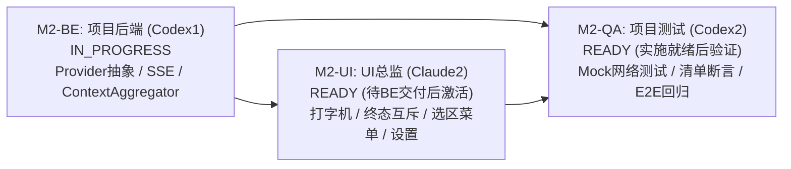

# M2 启动与任务授权交接文件

- 文件编号：`M2-KICKOFF-pm-001`
- 时间：`2026-09-07T23:52:00+08:00`
- 发送角色：项目经理（Claude1）
- 接收角色：主协调者（parent）、项目后端（Codex1）、UI 总监（Claude2）、项目测试（Codex2）
- 依据基线：
  - 原始产品需求：`docs/product/PRD-v0.1-source.md`（聚焦 R01–R09, R14, R16, R17）
  - 项目看板与规划：`docs/project/BOARD.md`、`docs/project/PLAN.md`
  - 后端契约基线：`docs/backend/CONTRACT-v0.1-draft.md`（版本：`0.1-draft / M0-BE-REV2`）
  - UI 架构与适配器基线：`docs/ui/READER-ADAPTER-SPEC.md`（版本：`v0.3-aligned-be-rev2`）
  - 前序收口交接：`docs/handoffs/M1-CLOSE-pm-001.md`、`docs/qa/M1-VERIFICATION-REPORT.md`
- 独占维护与变更路径：
  - `docs/project/BOARD.md`
  - `docs/project/PLAN.md`
  - `docs/logs/pm.md`
  - `docs/handoffs/M2-KICKOFF-pm-001.md`

---

## 1. M2 阶段启动背景与总体目标

用户已下达推进指令，项目正式进入 **M2 阶段（核心阅读流、批注笔迹持久化与 AI 交互联调）**。

### 1.1 前序阶段收口结论
- **M0 阶段**：文档设计、前后端契约规范、QA 验收矩阵均已 100% 互洽收口（CLOSED）；
- **M1-SETUP 阶段**：原生工程脚手架（SwiftPM + iOS 17.0+）、核心服务与 UI 切片已全量完成，GitHub Actions CI 真实云端环境（`macos-14`, Xcode 15.4, iPadOS 17.5 模拟器）测试全绿灯通过（26/26 PASS，0 失败），M1-SETUP 正式标记为 DONE。

### 1.2 M2 阶段核心攻坚目标
1. **真实阅读流与文档管理（R01, R02, R16）**：PDF 真实大文件异步加载、目录大纲跳转、书签 CRUD、缩放平移手势优化与会话重启阅读进度精准恢复；
2. **批注笔迹低延迟持久化（R03, R17）**：PencilKit 真实书写体验与 PDFView 几何对齐、笔画停顿防抖（2秒）、不可变快照固化与 `InkStorageEngine` 乐观锁文件持久化；
3. **文本选择与引用高亮联动（R04, R09）**：文本选择与 `SelectionCalloutMenu` 浮动菜单（解释、翻译、摘录）、`SourceAnchorFocusRing` 发光动画层与多点引用高亮；
4. **AI 助学服务与 Provider 流式联调（R05–R08, R14）**：OpenAI / Anthropic 兼容 Provider 流式客户端、SSE 解析、超时与取消、错误映射、五级上下文动态清单聚合器（`ContextAggregator`）、打字机动效呈现与终态互斥管理（`cancelled` 与 `failed`）。

---

## 2. 子任务拆解与排他目录边界授权

为确保严谨工程推进并杜绝代码冲突，PM 对 M2 拆解为三个子任务，明确划分排他目录与推进时序：

### 2.1 M2-BE：核心服务与 Provider 基础设施（项目后端 Codex1）
- **状态**：**`IN_PROGRESS`**（正式授权即刻开工）
- **责任人**：项目后端（Codex1）
- **排他可写目录**：
  - `StudyOS/Core/`
  - `StudyOS/Services/`
  - `StudyOS/Models/`
  - `StudyOS/Storage/`
  - `StudyOS/Contracts/`
  - `docs/backend/**`
  - `docs/logs/backend.md`
- **核心任务与交付范围**：
  1. **本地 LLM Provider 抽象与客户端实现**：
     - 定义与实现 `LLMProviderProtocol`；
     - 实现 OpenAI 兼容客户端（标准 `/v1/chat/completions` 流式接口）；
     - 实现 Anthropic 兼容客户端（`/v1/messages` 流式接口）；
     - 支持动态配置 `apiKey`、`baseURL`、`modelName` 与自定义 Headers。
  2. **SSE（Server-Sent Events）解析与流式响应**：
     - 构建高效稳定的 SSE 数据流解析器；
     - 处理 `data: {...}` 消息块，解析增量 Delta Token；
     - 支持 Token 粘包与断包处理，提供 `AsyncThrowingStream<String, Error>` 异步流输出。
  3. **超时控制与主动取消**：
     - 深度整合 Swift 并发取消模型（`Task.isCancelled`）；
     - 提供用户主动取消（联动底层 `URLSessionTask.cancel()`）；
     - 实现请求超时控制机制（默认 30s 握手与空闲超时）。
  4. **结构化网络错误映射**：
     - 统一转译网络异常为强类型枚举（`LLMError`）：鉴权失败 (401/403)、配额耗尽 (429)、网络不可达/超时、服务端异常 (500/502/503)、数据流格式损坏；
     - 提供可展示、可定位的用户友好错误描述。
  5. **五级上下文动态清单聚合器（`ContextAggregator`）**：
     - 严格实现 PRD 五级上下文动态构建：Level 1 选区文本 -> Level 2 当前页文本 -> Level 3 当前章节文本 -> Level 4 全篇大纲/元数据 -> Level 5 历史对话；
     - 生成透明、可审计的 `outboundItems: [OutboundItem]` 清单，确保向用户展示外发范围；
     - 实现敏感信息与超长上下文动态裁剪与过滤策略。
  6. **PDF 文本抽取与大纲索引优化**：
     - 优化 PDFView 文本提取与段落语义切分；
     - 处理无目录 PDF 的自动章节降级方案（避免伪造目录）；
     - 跨页选区坐标与 `PDFSelection` 几何边界计算。
- **交付标志**：产出交付文档 `docs/handoffs/M2-BE-backend-001.md`，并在 `docs/logs/backend.md` 记录详细实现日志。

---

### 2.2 M2-UI：交互流与 AI 呈现落地（UI 总监 Claude2）
- **状态**：**`READY`**（排定规划，待 M2-BE 核心协议与服务就绪后正式激活）
- **责任人**：UI 总监（Claude2）
- **排他可写目录**：
  - `StudyOS/UI/`
  - `StudyOS/Views/`
  - `StudyOS/Adapters/`
  - `StudyOS/ViewModels/`
  - `docs/ui/**`
  - `docs/logs/ui.md`
- **核心任务与交付范围**：
  1. **AI 侧栏流式打字机逐字呈现与动效**：
     - 在 `AISidebarView` 中实现平滑逐字吐字打字机动画；
     - 自动滚动至最新 Token，支持用户手动上滑暂停跟随与回弹锁定。
  2. **终态互斥管理与状态机闭环**：
     - 严格落实 `failed` 与 `cancelled` 互斥终态设计，杜绝错误沿用；
     - 实现 `alreadyTerminal` 防御逻辑，避免终态后再触发流式更新；
     - 针对失败状态提供直观重试（Retry）与网络配置跳转入口。
  3. **选区浮动菜单与高亮落地（`SelectionCalloutMenu`）**：
     - 监听 PDFView 选区生命周期（选择建立、拖拽调整、点击空白消除）；
     - 浮动展示「解释」、「翻译」、「摘录到笔记」操作菜单；
     - 触发操作时自动打包选区内容并打开 AI 侧栏。
  4. **原文多点引用高亮与聚焦光圈（`SourceAnchorFocusRing`）**：
     - 在阅读器画布上绘制多点引用高亮几何区域；
     - 点击 AI 回答中的引用锚点时，驱动视图平滑滚动并展示聚焦发光波纹动效。
  5. **设置面板与 Provider 配置管理**：
     - 提供 Provider 类型切换（OpenAI / Anthropic）；
     - 提供 Base URL、Model 名称输入与 API Key 安全保存（集成 Keychain 或本地安全沙盒）；
     - 提供「测试连接」交互按钮与即时连通性反馈。
- **交付标志**：产出交付文档 `docs/handoffs/M2-UI-ui-001.md`，并在 `docs/logs/ui.md` 记录详细实现日志。

---

### 2.3 M2-QA：自动化测试与端到端验证（项目测试 Codex2）
- **状态**：**`READY`**（排定规划，待实施波次推进后接入自动化测试与验证）
- **责任人**：项目测试（Codex2）
- **排他可写目录**：
  - `docs/qa/**`
  - `StudyOSTests/`
  - `StudyOSUITests/`
  - `docs/logs/qa.md`
- **核心任务与交付范围**：
  1. **Provider 流式网络 Mock 测试套件**：
     - 基于 URLProtocol 或 Mock Provider 模拟 SSE 流式返回；
     - 测试 Chunk 增量吐字、粘包拼装与 Unicode 跨包断裂解析；
     - 模拟 HTTP 401、429、500、网络超时及中断场景，断言异常转译合规性。
  2. **上下文清单与外发过滤断言**：
     - 针对五级上下文聚合器，编写自动化断言验证各项文本提取精度；
     - 验证 `outboundItems` 外发清单的完整性与隐私边界，确保无未授权数据渗出。
  3. **阅读与批注持久化端到端回归**：
     - 模拟快速高频 Apple Pencil 笔画绘制与 2 秒防抖触发；
     - 模拟多页并发保存与版本冲突（`SaveInkError.conflict`）防御；
     - 验证两路笔记删除策略（`keep` 保留副本解绑 vs `delete` 级联删除）业务逻辑。
  4. **UI 状态机互斥与 CI 流水线回归**：
     - 编写 XCTest 验证 UI 侧栏 `failed` / `cancelled` 终态互斥与 `alreadyTerminal` 防御；
     - 协助用户在 GitHub Actions 云端流水线上触发并监控全量测试通过。
- **交付标志**：产出验收测试报告 `docs/qa/M2-VERIFICATION-REPORT.md` 与交接文档 `docs/handoffs/M2-QA-qa-001.md`。

---

## 3. 协作规则与推进纪律

1. **目录排他性原则**：
   - 严禁任何人跨越己方独占目录修改代码（例如：后端严禁改动 UI，UI 严禁改动后端存储与核心服务，PM 严禁修改产品源码）；
   - 任何人不得修改他人日志文件（`docs/logs/*.md`）；
2. **共享契约变更流程**：
   - 共享契约（`StudyOS/Contracts/`）由 Codex1 作为主要实现者，如需扩展或修订，必须在交接文档中提请并经 PM 审阅确认；
3. **真实性与不伪造原则**：
   - 测试结果必须基于真实执行证据（CI Runner 日志或真机走查证据），严禁在未执行状态下伪造 PASS；
4. **推进波次执行安排**：
   - **第一波次（当前进行中）**：Codex1 推进 M2-BE；
   - **第二波次**：Claude2 推进 M2-UI；
   - **第三波次**：Codex2 推进 M2-QA 及 CI 绿灯闭环。

---

## 4. 授权指令

项目经理 Claude1 正式下达任务授权：
- **项目后端（Codex1）**：正式授权启动 **M2-BE** 核心服务实施，状态置为 **`IN_PROGRESS`**；请立即按照规范在 `docs/logs/backend.md` 记录真实系统时间戳与 READ_ACK/START，并开展实现工作。
- **UI 总监（Claude2）** 与 **项目测试（Codex2）**：任务状态置为 **`READY`**，请保持待命，待 M2-BE 交付物就绪后依序激活。
