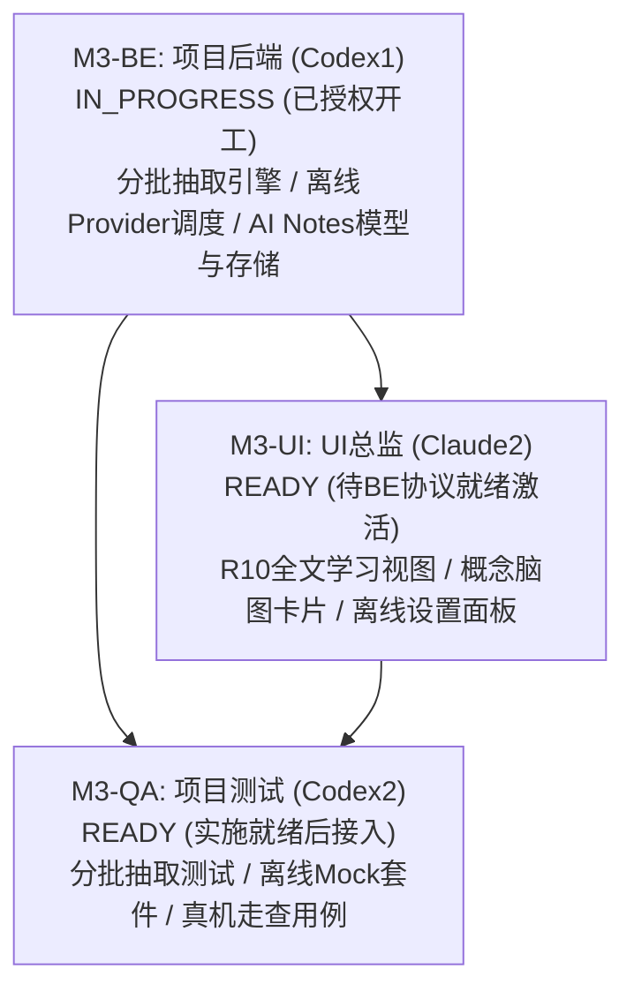

# M3 启动与任务授权交接文件

- 文件编号：`M3-KICKOFF-pm-001`
- 时间：`2026-09-08T10:48:35+08:00`
- 发送角色：项目经理（Claude1）
- 接收角色：主协调者（parent）、项目后端（Codex1）、UI 总监（Claude2）、项目测试（Codex2）
- 依据基线：
  - 原始产品需求：`docs/product/PRD-v0.1-source.md`（核心聚焦 R10 全文学习视图 P0、R11 AI Notes P1、R12 自动章节识别 P1、R14 离线 Provider 架构、R15 多轮上下文 P1、D Level 真机硬件走查）
  - 项目看板与阶段规划：`docs/project/BOARD.md`、`docs/project/PLAN.md`
  - 后端契约基线：`docs/backend/CONTRACT-v0.1-draft.md`（版本：`0.1-draft / M0-BE-REV2`）与已落地的 M2 领域模型及核心服务
  - UI 规范基线：`docs/ui/READER-ADAPTER-SPEC.md`（版本：`v0.3-aligned-be-rev2`）
  - 前序收口交接与验证报告：`docs/handoffs/M2-CLOSE-pm-002.md`、`docs/qa/M2-VERIFICATION-REPORT.md`（云端 CI 47/47 PASS）
- 独占维护与变更路径：
  - `docs/project/BOARD.md`
  - `docs/project/PLAN.md`
  - `docs/logs/pm.md`
  - `docs/handoffs/M3-KICKOFF-pm-001.md`

---

## 1. M3 阶段启动背景与总体目标

用户已下达正式推进指令，项目全面进入 **M3 阶段（本地离线模型适配、长文档分批研读与真机手写走查）**。

### 1.1 前序阶段收口结论
- **M0 阶段**：文档设计、前后端契约规范、QA 验收矩阵均已 100% 互洽收口（CLOSED）；
- **M1-SETUP 阶段**：原生工程脚手架（SwiftPM + iOS 17.0+）、核心服务与 UI 切片已全量完成，GitHub Actions CI 真实云端环境（`macos-14`, Xcode 15.4, iPadOS 17.5 模拟器）测试全绿灯通过（26/26 PASS，0 失败），收口为 DONE；
- **M2 阶段**：核心阅读流、批注笔迹持久化与 AI 交互联调全部闭环；不可变 `AggregatedContext` 强透传、原生 CryptoKit SHA-256 全量字节哈希、流式终态互斥（`failed` / `cancelled` / `alreadyTerminal`）及防重入预占机制全部合规；GitHub Actions CI（`macos-14` + iPadOS 17.5 模拟器 `iPad Pro 11-inch (M4)`）在 Commit `c429470` 上 **47 项自动化测试套件 100% 全部通过（47/47 PASS，0 失败，0 告警）**；对 `.document` 全文学习范围的阶段处置已完成安全限制与友好提示，杜绝以目录大纲伪造全文；M2-BE、M2-UI、M2-QA 均已标记为 DONE。

### 1.2 M3 阶段核心攻坚目标
1. **R10 全文学习视图与长文档分批研读 (P0)**：
   - 解决长文档/全书场景下的大篇幅内容抽取难题，落地**长文档异步分批抽取引擎**（落实 R10 P0 后端支撑），实现并发安全分块抽取与大纲聚合，提供进度反馈与取消机制；
   - 落地**全屏/分栏独立全文学习视图**（`FullDocumentStudyView`），呈现结构、概念、考点、重点、难点及知识关系卡片/脑图，支持与阅读器双向高亮跳转。
2. **端侧离线 LLM Provider 抽象协议与统一调度器 (R14 / 离线架构)**：
   - 扩展 `LLMProviderProtocol` 抽象本地端侧推理引擎接口（支持本地模型适配与调度）；
   - 实现本地端侧离线 Provider 与云端 OpenAI 兼容 Provider 的统一调度与无缝热切换；
   - 落实断网/弱网环境下的助学保活与优雅降级策略。
3. **R11 AI Notes 落地与数据持久化 (P1)**：
   - 实现 AI 助学内容一键存为可编辑卡片笔记（`AINoteCard`）；
   - 严格保留原文来源（文档 ID、页码、锚点矩形、时间戳）与关联手写批注快照；
   - 本地 SQLite/JSON 隔离持久化引擎，深度联动资料库两路删除策略（解绑保留副本 vs 级联彻底清除）。
4. **iPad 真实设备手写与交互走查 (D Level)**：
   - 弥补模拟器无法验证物理特性的边界，编排 iPad 真机走查用例；
   - 覆盖 Apple Pencil 硬件真实压感、笔锋倾斜角、高刷书写贴合感、手掌防误触（Palm Rejection）以及长时间阅读电池/发热体验。

---

## 2. 子任务拆解与排他目录边界授权

为保障多角色协同的严谨性与代码零冲突，PM 对 M3 进行模块化子任务拆解，明确划分排他目录与推进时序：

### 2.1 M3-BE：离线 Provider 与分批抽取引擎（项目后端 Codex1）
- **当前状态**：**`IN_PROGRESS`**（正式授权即刻开工）
- **责任人**：项目后端（Codex1）
- **排他可写目录**：
  - `StudyOS/Core/`
  - `StudyOS/Services/`
  - `StudyOS/Models/`
  - `StudyOS/Storage/`
  - `StudyOS/Contracts/`
  - `Package.swift`（单一工程配置写者）
  - `docs/backend/**`
  - `docs/logs/backend.md`
- **核心任务与交付范围**：
  1. **长文档异步分批抽取引擎（落实 R10 P0 后端支撑）**：
     - 设计并发安全、分批分块提取与增量大纲聚合机制（解决 M2 中未支持长文档一次性外发的安全限制）；
     - 支持按章节/页码范围分批加载文本，提供进度回调与异步取消支持（`Task.isCancelled`）；
     - 构建全文结构索引与概念摘要树，杜绝 Token 溢出，杜绝伪造假全文。
  2. **端侧离线 LLM Provider 抽象协议与统一调度器**：
     - 扩展 `LLMProviderProtocol` 抽象本地端侧推理引擎适配协议；
     - 构建统一模型调度器（`LLMDispatcher` / `ModelProviderCoordinator`），支持端侧离线 Provider 与云端 OpenAI 兼容 Provider 动态无缝热切换；
     - 实现弱网检测与完全无网环境下的自动降级与保活策略。
  3. **R11 AI Notes 数据模型与持久化服务**：
     - 定义结构化卡片笔记领域模型（`AINoteCard`），包含富文本内容、标签、时间戳、原始文档 ID、页码位置、精确来源锚点矩形及关联笔迹快照；
     - 实现本地 SQLite/JSON 隔离持久化引擎与事务写入；
     - 与现有 `MetadataStorageEngine` 两路删除策略对齐（文档删除时支持解绑保留或级联清除）。
  4. **工程配置唯一维护（Single Config Writer）**：
     - 独占负责 `Package.swift` 配置与依赖引入。
- **交付标志**：产出后端交付文档 `docs/handoffs/M3-BE-backend-001.md`，并在 `docs/logs/backend.md` 记录详细实现日志。

---

### 2.2 M3-UI：全屏全文学习视图与离线设置界面（UI 总监 Claude2）
- **当前状态**：**`READY`**（排定规划，待 M3-BE 接口契约与数据模型就绪后正式激活）
- **责任人**：UI 总监（Claude2）
- **排他可写目录**：
  - `StudyOS/UI/`
  - `StudyOS/Views/`
  - `StudyOS/Adapters/`
  - `StudyOS/ViewModels/`
  - `docs/ui/**`
  - `docs/logs/ui.md`
- **核心任务与交付范围**：
  1. **R10 全屏/分栏全文学习视图落地（`FullDocumentStudyView`）**：
     - 打造独立的全文研读主视图，支持全屏展开与自适应分栏；
     - 树状/脑图化呈现篇章结构、核心概念、高频考点、重点难点与知识脉络；
     - 支持点击概念卡片无缝联动阅读器并平滑滚动定位至原文所在物理页与引用高亮。
  2. **AI 助学笔记卡片沉淀交互（AI Notes）**：
     - 在 AI 侧栏与学习视图提供「一键存为笔记卡片」交互；
     - 卡片式笔记瀑布流呈现，支持原地富文本编辑、关联手写墨水与原书引用高亮回溯。
  3. **Provider 切换与离线模型设置界面**：
     - 在设置面板中提供端侧离线模型 vs 云端 Provider 切换控件；
     - 提供离线模型就绪状态、加载进度与运行参数配置；
     - 离线/弱网状态下的视觉警示与友好降级提示。
- **交付标志**：产出 UI 交付文档 `docs/handoffs/M3-UI-ui-001.md`，并在 `docs/logs/ui.md` 记录详细实现日志。

---

### 2.3 M3-QA：离线套件与分批抽取验证（项目测试 Codex2）
- **当前状态**：**`READY`**（排定规划，待实施推进后接入自动化测试与真机走查编排）
- **责任人**：项目测试（Codex2）
- **排他可写目录**：
  - `docs/qa/**`
  - `StudyOSTests/`
  - `StudyOSUITests/`
  - `docs/logs/qa.md`
- **核心任务与交付范围**：
  1. **长文档分批抽取引擎专项测试**：
     - 超大页码大文件并发分批提取压力测试；
     - 抽取中途取消、超时恢复与增量大纲完整性断言；
     - 杜绝假全文与摘要伪造断言。
  2. **端侧离线 Provider Mock 套件与调度测试**：
     - 本地离线 Provider Mock 实现与流式输出断言；
     - 端侧/云端热切换并发安全测试；
     - 断网与弱网场景下的优雅降级状态机验证。
  3. **AI Notes 持久化回归用例**：
     - 笔记卡片 CRUD 操作、引用锚点有效性与墨水关联持久化校验；
     - 两路删除策略（解绑保留副本 vs 级联删除）回归测试。
  4. **iPad 真机手写与硬件走查用例编排 (D Level)**：
     - 编写真机手写压感、倾斜角、书写低延迟与手掌贴屏防误触（Palm Rejection）走查用例；
     - 提供真机测试规范与证据归档模板。
- **交付标志**：产出验收测试报告 `docs/qa/M3-VERIFICATION-REPORT.md` 与交接文档 `docs/handoffs/M3-QA-qa-001.md`。

---

## 3. 协作规则与推进纪律

1. **目录排他性原则（严守边界）**：
   - 严禁跨越己方独占目录修改代码（后端严禁改动 UI，UI 严禁改动后端存储与核心服务，PM 严禁修改产品源码与工程配置）；
   - 严禁修改他人日志文件（`docs/logs/*.md`）；
2. **共享契约与工程配置流程**：
   - 共享契约（`StudyOS/Contracts/`）由 Codex1 作为主要实现者，如需扩展或修订，必须在交接文档中提请并经 PM 审阅确认；
   - `Package.swift` 及全局构建配置仍由 Codex1 作为唯一写者串行维护；
3. **真实性与不伪造原则**：
   - 测试结果必须基于真实执行证据（CI Runner 真实日志或真机走查证据），严禁在未执行状态下伪造 PASS；
4. **推进波次执行安排**：
   - **第一波次（当前进行中）**：Codex1 推进 M3-BE；
   - **第二波次**：Claude2 推进 M3-UI；
   - **第三波次**：Codex2 推进 M3-QA 及 CI 绿灯闭环。

---

## 4. 授权指令

项目经理 Claude1 正式下达任务授权：
- **项目后端（Codex1）**：正式授权启动 **M3-BE**，状态置为 **`IN_PROGRESS`**；请立即按照规范在 `docs/logs/backend.md` 记录真实系统时间戳与 READ_ACK/START，全面推进长文档异步分批抽取引擎、端侧离线 Provider 抽象协议与统一调度器、R11 AI Notes 数据模型与持久化服务实施。
- **UI 总监（Claude2）** 与 **项目测试（Codex2）**：任务状态置为 **`READY`**，请保持待命，待 M3-BE 交付物就绪后依序激活。
