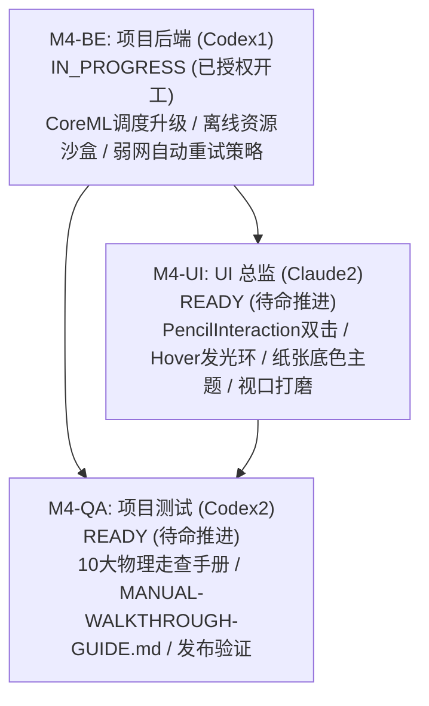

# M4 启动与任务授权交接文件

- 文件编号：`M4-KICKOFF-pm-001`
- 时间：`2026-09-08T13:41:27+08:00`
- 发送角色：项目经理（Claude1）
- 接收角色：主协调者（parent）、项目后端（Codex1）、UI 总监（Claude2）、项目测试（Codex2）
- 依据基线：
  - 原始产品需求：`docs/product/PRD-v0.1-source.md`（聚焦 R01–R17 核心阅读、Apple Pencil 批注、AI 助学与发布级物理体验）
  - 项目看板与阶段规划：`docs/project/BOARD.md`、`docs/project/PLAN.md`
  - 后端契约基线：`docs/backend/CONTRACT-v0.1-draft.md`（`0.1-draft / M0-BE-REV2` 及后续扩展）
  - 前序收口交接与验证报告：`docs/handoffs/M3-CLOSE-pm-001.md`、`docs/qa/M3-VERIFICATION-REPORT.md`（云端 CI 74/74 PASS）
- 独占维护与变更路径：
  - `docs/project/BOARD.md`
  - `docs/project/PLAN.md`
  - `docs/logs/pm.md`
  - `docs/handoffs/M4-KICKOFF-pm-001.md`

---

## 1. M4-RELEASE 阶段启动背景与里程碑目标

StudyOS 前期 M0（文档与架构设计）、M1-SETUP（原生工程脚手架）、M2（核心阅读流与 AI 交互联调）、M3（本地离线模型适配与分批研读）已全量收口闭环（DONE）。云端 CI（macOS-14 + iPadOS 17.5 模拟器）在 Commit `3636ac9` 上达成 8 大核心测试类 74 项自动化测试 100% 全部通过。

依据用户下达的正式推进指令，项目正式进入 **M4-RELEASE 阶段（实体硬件走查准备、Pencil 硬件手势增强、真机走查规程与发布就绪交付）**。

### 核心里程碑目标
1. **端侧 CoreML / 本地离线模型调度契约升级与沙盒弹性韧性（M4-BE）**：
   - 升级端侧离线模型调度契约，提供更精准的权重加载与内存释放协议；
   - 建立安全可靠的离线资源沙盒管理机制；
   - 建立应对真实弱网、抖动、高延迟及断网环境的自动重试、指数退避与透明降级保活策略。
2. **Apple Pencil 硬件手势深度集成与真机视口打磨（M4-UI）**：
   - 接入 iOS 原生 `UIPencilInteraction`，实现笔身双击快捷切换当前画笔/橡皮擦；
   - 支持 Apple Pencil Hover 笔尖悬停预测发光环（在笔尖触屏前提供可视落点与笔刷粗细预判）；
   - 提供深浅底色及多种护眼纸张底色主题无缝切换；
   - 针对 iPadOS 分屏（Split View）、台前调度（Stage Manager）以及横竖屏旋转进行视口与画布几何贴合打磨。
3. **iPad 真机与 Apple Pencil 物理走查规程手册编写（M4-QA）**：
   - 编制权威标准的《StudyOS iPad 真机与 Apple Pencil 物理走查规程手册》（`docs/qa/MANUAL-WALKTHROUGH-GUIDE.md`）；
   - 详细展开 10 大物理检验流，覆盖压感、倾斜、延迟、防误触、手势流转、长文档批次加载及硬件发热功耗。

---

## 2. 子任务拆解与排他目录边界授权

为保障跨角色协同的严谨性与代码零冲突，PM 对 M4-RELEASE 进行了模块化子任务拆解，明确划分排他目录与流转时序：

### 2.1 M4-BE：端侧模型调度升级与沙盒/重试策略（项目后端 Codex1）
- **当前状态**：**`IN_PROGRESS`**（正式授权即刻开工）
- **责任人**：项目后端（Codex1）
- **排他可写目录**：
  - `StudyOS/Core/`
  - `StudyOS/Services/`
  - `StudyOS/Models/`
  - `StudyOS/Storage/`
  - `StudyOS/Contracts/`
  - `Package.swift`（单一工程配置写者）
  - `docs/backend/**`
  - `docs/logs/backend.md`
- **核心任务与交付范围**：
  1. **端侧 CoreML / 本地模型加载调度契约升级**：
     - 升级端侧离线模型调度协议，支持真机 CoreML / 本地量化权重模型的按需流式加载与安全卸载；
     - 细化统一内存限额监控与内存告警（`didReceiveMemoryWarning`）安全熔断机制。
  2. **离线资源沙盒管理**：
     - 建立模型文件、文档缓存与全文索引的沙盒生命周期管理，提供持久化沙盒隔离保护；
     - 落实沙盒完整性校验（SHA-256 校验与防篡改）。
  3. **弱网断线自动重试与恢复策略**：
     - 为网络流式推理与云端 Provider 调用增加具备指数退避（Exponential Backoff）与抖动容错（Jitter）的自动重试机制；
     - 网络彻底不可用时实现优雅降级至本地端侧 Provider，断点续传与重连状态感知。
  4. **工程配置唯一维护（Single Config Writer）**：
     - 独占负责 `Package.swift` 依赖管理与构建参数配置。
- **交付标志**：产出后端交付文档 `docs/handoffs/M4-BE-backend-001.md`，并在 `docs/logs/backend.md` 记录实现日志。

---

### 2.2 M4-UI：硬件手势支持、底色主题与视口打磨（UI 总监 Claude2）
- **当前状态**：**`READY`**（排定规划，待 M4-BE 契约接口稳定后推进）
- **责任人**：UI 总监（Claude2）
- **排他可写目录**：
  - `StudyOS/UI/`
  - `StudyOS/Views/`
  - `StudyOS/Adapters/`
  - `StudyOS/ViewModels/`
  - `docs/ui/**`
  - `docs/logs/ui.md`
- **核心任务与交付范围**：
  1. **Apple Pencil 硬件手势支持**：
     - 集成原生 `UIPencilInteractionDelegate`，响应笔身双击（Double Tap）快速切换“当前画笔”与“橡皮擦”工具态；
     - 支持 Apple Pencil 笔尖悬停（Hover）预测发光环与动态落点预判（针对 iPad Pro M2/M4 悬停特性）。
  2. **深浅阅读底色与纸张主题切换**：
     - 扩展阅读器背景主题，支持日光白、护眼米黄、羊皮纸色、深色夜间等多种预设底色；
     - 确保在各主题下 PencilKit 墨水、高亮选区与 PDF 文字对比度符合无障碍标准。
  3. **真机 UI 视口打磨与自适应**：
     - 适配台前调度（Stage Manager）多窗口无级缩放与 Split View 分屏；
     - 保证横竖屏旋转时 PDF 与 PencilKit 画布绝对几何对齐，消灭任何视口裁切或错位。
- **交付标志**：产出 UI 交付文档 `docs/handoffs/M4-UI-ui-001.md`，并在 `docs/logs/ui.md` 记录详细实现日志。

---

### 2.3 M4-QA：物理走查手册与发布验证矩阵（项目测试 Codex2）
- **当前状态**：**`READY`**（待命，推进规程编写与验收矩阵）
- **责任人**：项目测试（Codex2）
- **排他可写目录**：
  - `docs/qa/**`
  - `StudyOSTests/`
  - `StudyOSUITests/`
  - `docs/logs/qa.md`
- **核心任务与交付范围**：
  1. **编制《StudyOS iPad 真机与 Apple Pencil 物理走查规程手册》**：
     - 创建 `docs/qa/MANUAL-WALKTHROUGH-GUIDE.md`；
     - 建立系统、结构化、可复现的真机物理走查指引，覆盖 10 大物理检验流。
  2. **10 大真机物理检验流细化**：
     - 流 1：Apple Pencil 物理压感与线条动态响应（细线条到饱满笔触线性度）；
     - 流 2：Apple Pencil 笔锋物理倾斜角度走查（马克笔/铅笔侧锋阴影物理渲染）；
     - 流 3：PencilKit 极低书写延迟与高刷采样（ProMotion 120Hz 跟手性、笔尖与墨迹贴合度）；
     - 流 4：手掌贴屏防误触走查（Palm Rejection）（手腕/手掌搭屏自然书写无误划、无滚动冲突）；
     - 流 5：Apple Pencil 硬件手势流转（笔身双击工具切换、Hover 笔尖预测悬停光环）；
     - 流 6：离线长文档分批抽取与内存峰值走查（百页以上长文档分批异步加载，前台保持 60fps 流畅无掉帧）；
     - 流 7：本地端侧模型加载与长时功耗/发热走查（真机连续运行推理 30 分钟无过热降频、电池损耗平缓）；
     - 流 8：弱网断网与云端/本地 Provider 无缝热切换（网络中断自动重试、无感回退端侧模型）；
     - 流 9：深浅色与多种纸张背景主题无缝切换（墨水色彩对比度自适应、护眼视觉舒适度）；
     - 流 10：多窗口、分屏与横竖屏旋转自适应视口打磨（Stage Manager / Split View 坐标几何零偏移）。
  3. **自动化测试套件回归与发布就绪检验**：
     - 维护既有 74 项云端 CI 自动化测试套件持续通过；
     - 增加 M4 阶段新引入契约与重试机制的自动化单元测试。
- **交付标志**：产出《StudyOS iPad 真机与 Apple Pencil 物理走查规程手册》（`docs/qa/MANUAL-WALKTHROUGH-GUIDE.md`）及 QA 交付文档 `docs/handoffs/M4-QA-qa-001.md`。

---

## 3. 协作守则与执行纪律

1. **写者权限排他性**：
   - 只有 PM 可以更新 `docs/project/BOARD.md`、`docs/project/PLAN.md`；
   - 只有 Codex1 可以更新 `Package.swift`、后端源码及后端文档；
   - 严禁任何角色跨目录修改他人负责的文件。
2. **严禁伪造测试结果**：
   - 明确区分模拟器自动化测试（CI PASS）与真机物理硬件走查（D Level）；
   - 规程手册必须提供清晰的客观量化检验标准，供真机实测执行。
3. **交接流转规范**：
   - Codex1 在完成 M4-BE 并产出 `M4-BE-backend-001.md` 后，通知 Claude2 激活 M4-UI 及通知 Codex2 进行测试验证。
