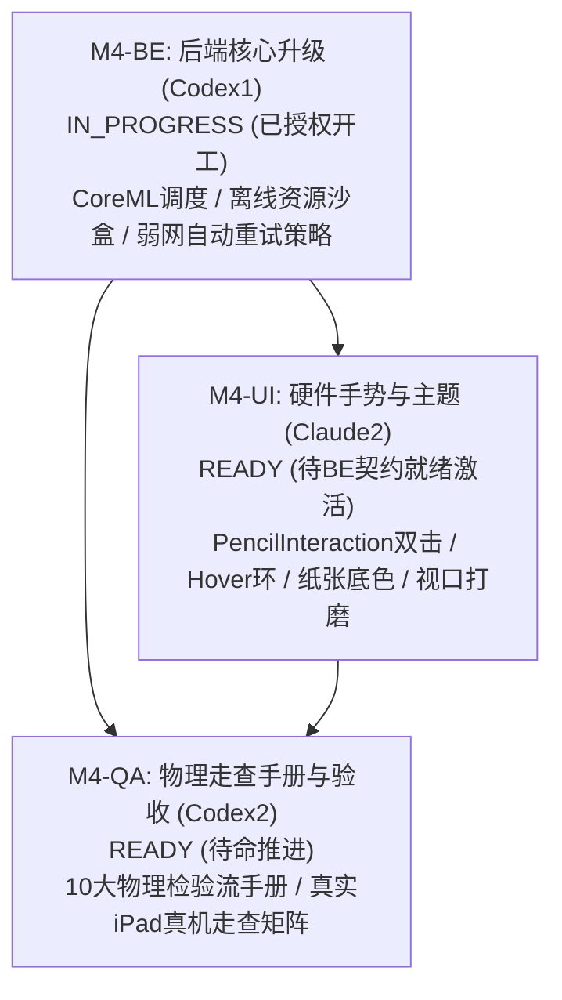

# StudyOS 阶段规划

基线：`docs/product/PRD-v0.1-source.md`。用户已确认 iPad 原生 App，优先阅读与手写体验；不改写原始 PRD。用户有 Mac 和 iPad，可协助后续构建和真机测试。当前 Windows 环境只能准备方案与源码，尚无构建或设备验证结果。

## 需求与验收编号

编号保持稳定；具体测试步骤由 QA 矩阵展开。以下 P0 不因排期而取消。

| 编号 | 优先级 | 需求 | 最低验收结果 |
|---|---|---|---|
| R01 | P0 | PDF 导入 | 合法 PDF 导入可读，失败可理解且不破坏已有资料 |
| R02 | P0 | PDF 阅读 | 缩放、跳页、目录、书签可用，阅读位置重启恢复 |
| R03 | P0 | Apple Pencil 批注 | 高亮、下划线、自由书写、橡皮擦可用；缩放旋转及重开后位置正确 |
| R04 | P0 | 文本选择 | 可选文本，跨行选择与页面位置一致；无文本页有清楚状态 |
| R05 | P0 | 选中内容解释 | 使用当前选区且不会错误沿用旧选区，回答可回到来源 |
| R06 | P0 | 当前页助学 | 六段结构符合 PRD，阅读问题默认无答案 |
| R07 | P0 | 当前章节助学 | 显示实际章节范围，缺少章节结构时明确说明并提供范围方案 |
| R08 | P0 | AI 自由问答 | 文档优先，资料不足明确说明；取消、失败和重试可用 |
| R09 | P0 | AI 回答定位原文 | 引用绑定稳定文档版本和页面位置，点击能定位，失效不得乱跳 |
| R10 | P0 | 全文学习视图 | 独立入口，提供结构、概念、重点、难点和知识关系，关联原文 |
| R11 | P1 | AI Notes | AI 内容存为可编辑文本，保留来源、时间及用户批注，支持图片 |
| R12 | P1 | 自动章节识别 | 可追溯章节范围，识别失败不伪造目录 |
| R13 | P1/基线冲突 | 文档内搜索 | 正文“至少支持”与优先级表 P1 不一致；保留在 V0.1 范围，排入阅读阶段 |
| R14 | P1 | Provider 设置 | 首个兼容接口可配置，业务依赖抽象；P0 AI 路径仍需要最小 Provider 能力 |
| R15 | P1 | 多轮上下文 | 对话与文档范围关联，裁剪可控 |
| R16 | V0.1 基础 | 资料库 | 文件夹、搜索、最近阅读、收藏、进度、导入均保留 |
| R17 | 全阶段约束 | 隐私与本地持久化 | PDF、批注、笔记、位置、结构与设置本地保存；发送范围可见，只发送必要上下文 |

R02 同时验证默认全屏阅读、按需 AI 侧栏与返回阅读。R06/R07 六段指主题、重点、前置知识、概念、易错点、阅读问题。五级上下文、来源模式、可点击前置知识均为对应 AI 需求的组成部分。

## 阶段与依赖

| 阶段 | 内容 | 阶段出口 | 当前状态 |
|---|---|---|---|
| M0 | 职责、需求拆分、原生架构和契约提案、验收准备 | 文档齐全且无未决冲突；经 QA 闭环复核；不代表产品通过测试 | **CLOSED (收口完成)** |
| M1-SETUP | 原生工程脚手架、配置基线、核心服务与基础切片 | 单一工程配置就绪，CI 云端构建通过 (macOS-14/Xcode 15.4/iPadOS 17.5 模拟器)，26 项自动化测试全量 PASS | **CLOSED (收口完成)** |
| M2 | 核心阅读流、批注笔迹持久化与 AI 交互联调 (R01–R09, R14, R16, R17) | 原生阅读与手写流打通，笔迹持久化闭环，AI 助学流式与五级上下文聚合接入，真实正文透传与 SHA-256 全量哈希闭环，CI 47/47 PASS | **CLOSED (收口完成)** |
| M3 | R10 全文学习视图分批研读、本地离线模型适配、R11 AI Notes 与自动化套件 (R10, R11, R14) | 长文档异步分批抽取引擎闭环，本地离线模型 Provider 抽象与状态机落地，AI Notes 乐观锁/两路删除闭环，CI 74/74 PASS | **CLOSED (收口完成)** |
| M4-RELEASE | 真实 iPad 硬件与 Apple Pencil 物理走查、硬件手势增强、真机走查规程与发布就绪交付 (R01–R17) | 端侧 CoreML/离线沙盒/重试策略落地，Pencil 双击/Hover 手势支持与主题切换打磨，10 大物理走查规程手册就绪，发布交付闭环 | **IN_PROGRESS (实施中)** |

UI 设计与后端领域设计可并行。共享契约冻结先于两端对接；工程配置、依赖锁和迁移必须由单一写者串行更改。M1 出口不能用模型或截图替代手写真机验收。

## M1-SETUP 工程规划与分工基线

1. **准入条件**：
   - M0 阶段全部设计规范、契约草案（0.1-draft / M0-BE-REV2）及 QA 验收矩阵（R01–R21、UI-T01–UI-T11）收口闭环（已达成）；
   - 真实 Mac 构建环境与 Xcode 15+ 具备，获得主协调者与用户代码实施授权。
2. **技术栈基线**：
   - 目标平台：iPadOS 17.0+ 原生应用（适配 iPad 分屏与多窗口）；
   - 前端/UI 框架：SwiftUI + PDFKit（双向同步与无缝缩放） + PencilKit（原生 Apple Pencil 低延迟手写与墨水序列化）；
   - 核心服务/后端：Swift 原生并发（`async/await`、`MainActor`、`actor` 隔离），结构化契约强类型定义；
   - 本地持久化：SQLite / 本地文件沙盒（PDF 与墨水独立存储），严格遵从本地优先与隐私原则。
3. **单一工程配置写者（Single Config Writer）**：
   - **Codex1（项目后端）**为唯一工程全局配置写者，独占负责 `StudyOS.xcodeproj`、`Package.swift`、`Info.plist`、Entitlements 及依赖管理文件的初始化与修改，杜绝多人冲突。
4. **源码目录排他分工（开工后执行）**：
   - **后端/核心服务目录**（Codex1 独占）：`StudyOS/Core/`、`StudyOS/Services/`、`StudyOS/Models/`、`StudyOS/Storage/`；
   - **前端/客户端 UI 目录**（Claude2 独占）：`StudyOS/UI/`、`StudyOS/Views/`、`StudyOS/Adapters/`；
   - **测试目录**（Codex2 独占）：`StudyOSTests/`、`StudyOSUITests/`；
   - 跨模块调用仅通过协议与共享契约（`StudyOS/Contracts/`），契约变更必须先由 PM/QA 审阅。
5. **M1-SETUP 验收要求**：
   - 在用户 Mac 环境可成功执行 `xcodebuild` 或 SwiftPM 构建，0 编译错误、0 阻塞警告；
   - 包含最小 PDF 加载渲染与 PencilKit 墨水画布绑定的最小可运行切片；
   - 真实构建与运行测试在开工后如实记录，无真机环境严禁伪造测试通过。

## 已收敛与待收敛决策

- **已收敛 (M0/M1/M2/M3 成果)**：
  - 技术栈确定为 iPad 原生 SwiftUI + PDFKit + PencilKit；
  - 数据契约收口至 `0.1-draft / M0-BE-REV2`，会话隔离安全导航、PageKey/快照墨水保存、终态互斥拆分、外发清单与两路删除均完成前后端一致性闭环；
  - 核心阅读流、批注笔迹持久化、五级上下文聚合、全量 CryptoKit SHA-256 哈希、不可变 `AggregatedContext` 强透传及流式终态互斥（`failed` / `cancelled` / `alreadyTerminal`）在云端 CI（macOS-14 + iPadOS 17.5 模拟器）上以 47/47 测试 100% 通过验证闭环；
  - `.document` 全文范围在 M2 完成安全限制与友好提示，杜绝伪造全文；
  - **M3 核心能力全面收敛**：
    1. 长文档异步分批抽取引擎（`DocumentBatchExtractionEngine`）：精准切片、无遗漏无重复页码平铺、单调递增流式进度与敏捷协作取消；
    2. 端侧本地离线大模型 Provider 抽象与调度（`LocalMockLLMProvider`）：状态机严格流转、内存精确统计与释放、流式分块吐字与未加载时自动拉起唤醒；
    3. AI Notes 卡片笔记系统（`AINoteService`）：来源锚点高保真、乐观锁防版本冲突、原文档删除时 `.keep` 解绑与 `.delete` 级联物理清除两路联动、与基础 Note 双向无损互转；
    4. 全屏全文学习研读视图（`FullDocumentStudyService` / `FullDocumentStudyView`）：概念网络、考点难点、章节研读指引全要素聚合模型，高速内存缓存命中与跨实例冷启动沙盒恢复；
    5. Swift 6 严格并发检查完整模式 (`-strict-concurrency=complete`) 零警告通过，全量 8 大测试类 74 项测试用例在 GitHub Actions macOS-14 + iPadOS 17.5 模拟器上 **100% 全部通过 (74/74 PASS)**。
- **待收敛 (M4-RELEASE 实体硬件走查与交付期)**：
  - 实体 iPad 设备与 Apple Pencil 硬件真机走查（物理压感 Force、笔锋倾斜角 Tilt、双击工具切换、手掌贴屏防误触 Palm Rejection 与极低书写延迟）；
  - 端侧真实 CoreML / 本地模型沙盒调度与长期发热功耗压测；
  - 真实生产公网弱网、DNS 波动环境下的自动重试与优雅降级。

## M4-RELEASE 阶段规划与子任务细分

### 1. 里程碑目标
M4-RELEASE 为 StudyOS 首发交付与真机就绪阶段，旨在将前期云端 CI 模拟器已闭环的 74 项高健壮性自动化成果，平滑过渡至真实硬件物理走查并达成 App Store / 内部 Ad-Hoc 原生发布标准：
1. **端侧模型调度与网络韧性（M4-BE）**：升级端侧 CoreML / 本地离线模型加载调度契约，建立离线资源沙盒隔离存储与管理机制，构建弱网/断网自动重试、指数退避与优雅保活恢复策略；
2. **Apple Pencil 硬件手势与阅读主题（M4-UI）**：基于 `UIPencilInteraction` 原生硬件事件实现双击切换橡皮/笔刷、笔尖悬停 Hover 预测发光环，支持深浅底色与护眼纸张主题切换，精细打磨 Stage Manager 与横竖屏视口对齐；
3. **真机与物理走查规程手册（M4-QA）**：编制标准《StudyOS iPad 真机与 Apple Pencil 物理走查规程手册》（`docs/qa/MANUAL-WALKTHROUGH-GUIDE.md`），规范 10 大物理检验流，覆盖压感、倾斜、延迟、防误触、手势流转、长文档批次加载与硬件发热。

### 2. 子任务拆解与排他目录

1. **M4-BE（项目后端 Codex1）**：
   - 状态：`IN_PROGRESS`（正式授权即刻开工）；
   - 排他目录：`StudyOS/Core/`、`StudyOS/Services/`、`StudyOS/Models/`、`StudyOS/Storage/`、`StudyOS/Contracts/`、`Package.swift`、`docs/backend/**`、`docs/logs/backend.md`；
   - 核心内容：端侧 CoreML / 本地模型加载调度契约升级、离线资源沙盒管理、弱网断线自动重试与恢复策略。
2. **M4-UI（UI 总监 Claude2）**：
   - 状态：`READY`（待命，待 M4-BE 契约接口稳定后推进）；
   - 排他目录：`StudyOS/UI/`、`StudyOS/Views/`、`StudyOS/Adapters/`、`StudyOS/ViewModels/`、`docs/ui/**`、`docs/logs/ui.md`；
   - 核心内容：Apple Pencil 硬件手势支持（`UIPencilInteraction` 双击切换橡皮/当前笔、Apple Pencil Hover 笔尖悬停预测光环）、阅读器深浅底色与多重纸张背景主题切换、分屏/旋转视口精度打磨。
3. **M4-QA（项目测试 Codex2）**：
   - 状态：`READY`（待命，制定规程与测试矩阵）；
   - 排他目录：`docs/qa/**`、`StudyOSTests/`、`StudyOSUITests/`、`docs/logs/qa.md`；
   - 核心内容：编写《StudyOS iPad 真机与 Apple Pencil 物理走查规程手册》（`docs/qa/MANUAL-WALKTHROUGH-GUIDE.md`），覆盖 10 大物理检验流（压感、倾斜、延迟、防误触、手势流转、分批抽取、本地模型发热功耗、弱网重试、纸张底色、多窗口视口）。

