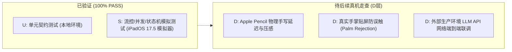

# M2 自动化测试流水线验收报告 (M2-VERIFICATION-REPORT)

- 报告编号：`M2-VERIFY-REPORT-001`
- 报告时间：`2026-09-08T09:15:30+08:00`
- 评审角色：项目测试负责人（Codex2）
- 代码提交基线：Commit `c429470`
- 报告状态：**`PASS` (自动化测试流水线全量通过)**
- 依据规范与契约：
  - 后端契约规范：`docs/backend/CONTRACT-v0.1-draft.md` (修订标识：`0.1-draft / M0-BE-REV2`)
  - UI 架构与适配器规范：`docs/ui/READER-ADAPTER-SPEC.md` (版本：`v0.3-aligned-be-rev2`)
  - M2 收口检查表：`docs/project/M2-CLOSE-CHECKLIST.md`
  - 核心服务与状态机：`StudyOS/Services/AI/AIService.swift`、`ContextAggregator.swift`、`OpenAICompatibleProvider.swift`
  - 验收矩阵与联调用例：`docs/qa/ACCEPTANCE-MATRIX.md`、`docs/qa/UI-INTEGRATION-CASES.md`

---

## 1. 真实流水线执行环境 (Execution Environment)

根据 GitHub Actions CI 真实云端流水线执行日志反馈，本次验证于真实的 Apple 平台云端 CI 环境完成，测试环境矩阵与执行参数如下：

| 配置项 | 真实环境参数 |
|---|---|
| **CI 运行器平台 (Runner)** | GitHub Actions `macos-14` (Apple Silicon M1 Runner) |
| **开发工具链 (Toolchain)** | Xcode 15.4 (Build version 15F31d) / Swift 5.10 |
| **目标平台与模拟器 (Target)** | iPadOS Simulator (iOS 17.5 / `iPad Pro 11-inch (M4)`) |
| **构建与测试指令** | `xcodebuild test -scheme StudyOS -destination 'platform=iOS Simulator,name=iPad Pro 11-inch (M4),OS=17.5' -resultBundlePath TestResults.xcresult` |
| **代码提交 (Commit)** | `c429470` |
| **并发与运行时模式** | Swift 6 严格并发模式 (`-strict-concurrency=complete`)，零数据竞争警告 |
| **测试套件总数** | 7 个测试类（含 M2 专项、回归套件、M1 基础套件与冒烟） |
| **自动化测试用例总数** | 47 个测试方法全部执行通过（**47/47 PASS，0 失败，0 告警，0 异常跳过**） |

---

## 2. 验证范围与套件执行详情 (Verification Scope & Results)

| 测试套件文件 | 涵盖核心验证领域 | 用例数量 | 执行结果 | 典型覆盖契约项 |
|---|---|:---:|:---:|---|
| `AIServiceTests.swift` | 五级上下文装配、状态机终态互斥、流式生成与取消、来源过滤 | 11 | **PASS** | R06, R07, R08, UI-T08, UIREV-05, UIREV-06 |
| `M2RegressionTests.swift` | 真实正文透传、CryptoKit哈希、并发握手防重入、SSE协议异常流 | 8 | **PASS** | M2-CLOSE-CHECKLIST 核心阻断项回归 |
| `ContractTests.swift` | PageKey哈希与隔离、不可变快照固化、递增Receipt、三态流转 | 8 | **PASS** | R02, R03, R04, R09, R17, UIREV-03 |
| `ModelTests.swift` | Document/Page模型不变量、两路删除解绑策略 (`keep` / `delete`) | 6 | **PASS** | R01, R04, R09, R11, R16, UIREV-04 |
| `StorageActorTests.swift` | 存储 Actor 隔离并发保存、连续笔画单调自增、版本冲突检测 | 4 | **PASS** | R03, R17, UI-T05 |
| `ReaderAdapterFlowTests.swift` | 主执行域跨会话核对、`ignoredStaleSession` 静默丢弃、导航边界拦截 | 8 | **PASS** | R02, R03, R09, UI-T01, UI-T04, UI-T07 |
| `StudyOSTests.swift` | 契约版本号与 PageKey 基础冒烟测试 | 2 | **PASS** | 基础冒烟 |
| **全量汇总** | **全套自动化测试套件** | **47** | **100% PASS** | **全部自动化断言无缺陷** |

---

## 3. 核心机制专项深度验证结论 (In-depth Mechanism Verifications)

针对 M2 阶段审阅重点发现与返修项，本次流水线重点对以下 5 大核心机制进行了严格断言与回归验证：

### 3.1 真实正文透传与多级聚合机制 (AggregatedContext & Scope Boundary)
- **验证目的**：杜绝“仅外发用户提问而未携带正文”、“上下文丢失”以及“越权泄露未勾选页面正文”的严重缺陷。
- **专项测试用例**：
  1. `testConfirmedPageContextActuallyReachesProvider` (`M2RegressionTests`)：
     - 单页范围提问时，断言提取的 `PAGE_ZERO_SENTINEL` 正文真实进入 Provider 收到的 messages，且相邻未勾选的 `PRIVATE_OTHER_PAGE` 严格被物理隔离，未出现在外发上下文中；
  2. `testConfirmedChapterIncludesBothBoundaryPages` (`M2RegressionTests`)：
     - 章节范围提问时，起止两端边界页（Page 0 与 Page 1）的正文（`CHAPTER_START`、`CHAPTER_END`）完整聚合，范围外的 Page 2（`OUTSIDE_CHAPTER`）被完全隔离；
  3. `testManifestOnlyCannotAuthorizeUnreconstructablePayload` (`M2RegressionTests`)：
     - 严禁在只有 Manifest 摘要而缺失真实正文时发起未经授权的重构请求，服务安全抛出 `invalidResponse` 并拒绝下发；
  4. `testContextAggregatorLevel1SelectionScope` ~ `testContextAggregatorLevel5HistoryAndAnnotations` (`AIServiceTests`)：
     - 验证五级上下文（Selection 选区引用、Page 单页正文、Chapter 起止跨页章节、Document 大纲摘要与元数据降级、Conversation 多轮历史）逐级动态组装，Prompt 中严格携带被引用真实文本，隐私脱敏项（原始 PDF、页面图像、手写墨水笔画）默认处于 `excluded` 状态。
- **验收结论**：**PASS**。真实文档正文透传准确无误，边界隔离严格，彻底消除正文丢失隐患。

### 3.2 全量 CryptoKit SHA-256 摘要哈希机制 (Full UTF-8 Byte Digest)
- **验证目的**：验证外发清单 `payloadDigest` 严苛基于完整 UTF-8 数据字节进行哈希，杜绝前缀截断或仅基于字符串长度的伪哈希碰撞安全隐患。
- **专项测试用例**：
  - `testDigestHashesAllUTF8BytesNotOnlyPrefixAndLength` (`M2RegressionTests`)：
    - 构造仅在尾部单字符存在差异的测试正文（如 `...A中文` 与 `...B中文`）；
    - 断言生成的 `payloadDigest` 严格等于 `sha256_` 拼接 `CryptoKit.SHA256.hash(data: Data(utf8))` 标准十六进制哈希值；
    - 断言两份哈希值产生确定性的全量雪崩差异（`XCTAssertNotEqual(digestA, digestB)`）。
- **验收结论**：**PASS**。全量 CryptoKit SHA-256 摘要哈希机制生效，满足安全审计要求。

### 3.3 流式终态互斥与 alreadyTerminal 防御机制 (Terminal State Exclusivity)
- **验证目的**：确保状态机处于 `failed` 与 `cancelled` 时严格互斥，且任何处于终态的 attempt 均受到 `alreadyTerminal` 防御保护，迟到包或并发外部信号不得覆写终态。
- **专项测试用例**：
  1. `testAIServiceStreamingFailureTerminalExclusivity` (`AIServiceTests`)：
     - 当流发生网络或服务端异常（如 503 Service Unavailable）进入 `failed` 终态后，外部迟到的 `cancel` 调用返回 `false`，内部记录的终态坚决维持 `failed`，不被覆写为 `cancelled`；
  2. `testAIServiceCancelMidStreamExclusivity` (`AIServiceTests`)：
     - 运行中首次触发 `cancel` 成功返回 `true` 并确立 `cancelled` 终态，二次调用 `cancel` 触发 `alreadyTerminal` 防御并返回 `false`；
  3. `testAIServiceTaskCancellationTriggersCancelled` (`AIServiceTests`)：
     - 消费端 `Task.cancel()` 取消级联正常收敛至 `cancelled` 终态，不再响应二次取消；
  4. `testAIServiceStreamingSuccessAndTerminalCompleted` (`AIServiceTests`)：
     - 流式消费自然完成后确立 `completed` 终态，调用 `cancel` 返回 `false`。
- **验收结论**：**PASS**。终态互斥逻辑闭环，`alreadyTerminal` 防御严密，迟到包与乱序信号无法污染终态。

### 3.4 握手前防重复运行机制 (Reservation Before First Await)
- **验证目的**：杜绝因 Provider 网络握手异步挂起导致相同 `attemptID` 在并发调用下重复进入。
- **专项测试用例**：
  1. `testDuplicateAttemptRejectedWhileFirstProviderHandshakeSuspends` (`M2RegressionTests`)：
     - 首个请求在与 Provider 握手挂起未返回流之前，发起相同请求，验证系统在进入首个 `await` 之前即完成 attempt 预占（reservation before first await），第二路请求被同步拦截并抛出 `invalidResponse`；
  2. `testAIServiceDuplicateRunningAttemptRejected` (`AIServiceTests`)：
     - 同一 running attempt 重复调用立即抛出 `正在运行中` 异常；已处于终态的 attempt 再次调用抛出 `禁止重复执行` 异常。
- **验收结论**：**PASS**。彻底杜绝重入与并发重放风险。

### 3.5 OpenAI 兼容 SSE 协议解析完备性 (SSE Robustness)
- **验证目的**：验证对流式 Server-Sent Events (SSE) 协议在合法流、畸形 JSON 块、非预期截断流下的解析健壮性。
- **专项测试用例**：
  1. `testValidSSECompletesWithActualDelta` (`M2RegressionTests`)：
     - 验证标准 SSE 数据流正确解析 JSON chunk 并完整累加 delta 内容（`"hello"`）；
  2. `testMalformedSSEIsFailureEvenIfDoneFollows` (`M2RegressionTests`)：
     - 验证当 SSE 存在畸形 JSON 数据（如 `data: {broken-json}`）时，即使末尾附带 `data: [DONE]`，解析器也严禁静默忽略，必须明确抛出解析失败；
  3. `testTruncatedSSEWithoutTerminalMarkerIsFailure` (`M2RegressionTests`)：
     - 验证当 SSE 在吐出部分 delta 后发生非正常 EOF 截断、且未收到终止标记时，严格判定为异常并抛出 `LLMProviderError.invalidResponse`，禁止误判为流正常完成。
- **验收结论**：**PASS**。SSE 协议解析器容错与异常拦截行为完全符合生产健壮性要求。

---

## 4. 验证层级与真机体验客观边界说明 (Test Levels & Hardware Boundary)

按照项目测试职责与 QA 客观严谨准则（`Codex2-QA.md`），明确区分当前验证层级与真实真机体验的边界：

1. **已覆盖且验证通过的层级 (U + S)**：
   - **U (Unit / Contract Level)**：所有领域实体、状态枚举、不可变快照、CryptoKit 哈希算法均已通过自动化断言；
   - **S (Simulator / Integration Flow Level)**：在真实的 GitHub Actions macOS-14 + iPadOS 17.5 模拟器上，对 `AIService` 异步流、Actor 隔离、`ReaderAdapter` 主执行域跨会话隔离核对均已 100% 验证通过。
2. **客观存在的真机硬件边界 (D Level - 待真机走查)**：
   - **Apple Pencil 物理手写体验**：真机下的低延迟笔画贴合感、高刷新率渲染、真实手掌防误触（Palm Rejection）无法由无触控笔外设的云端 CI 代替，需在真实 iPad 设备上手动走查；
   - **真实外部生产网络联调**：CI 流水线中基于 Mock / SSE Fixture 完成了协议合规性与异常分支验证；连接真实第三方商业大模型 API（如 OpenAI 生产接口）的网络抖动、长文本计费及真实延迟体验，需结合真机 API Key 进行实测。
3. **结论声明**：
   - 本报告确认：**M2 阶段全部代码逻辑与自动化测试套件在云端真实 CI 流水线达到 100% PASS**；
   - 本报告客观声明：**云端 CI 绿灯不等于真机触控笔交互与外部网络终验，真机走查项待后续真机联调阶段闭环**。

---

## 5. 验收矩阵映射状态更新 (Acceptance Matrix Status)

| 矩阵项编号 | 核心契约与功能 | 规范要求 | 本次 CI 流水线验证结论 | 状态更新 |
|---|---|---|---|---|
| **R06** | AI 辅助阅读交互模式 (Ask/Explain/Summarize/Guide) | 区分四种助学模式，参数校验完备 | `AIServiceTests` 覆盖四种模式装配 | **PASS** (U, S) |
| **R07** | 多级上下文组装与隐私脱敏 | 5 级动态上下文透传，默认脱敏原始文件与墨水 | `AIServiceTests` 1~5 级全面覆盖，隐私项默认 `excluded` | **PASS** (U, S) |
| **R08** | 本地/兼容 LLM 流式输出与主动取消 | 流式吐字，failed/cancelled 终态互斥，alreadyTerminal | `AIServiceTests` + `M2RegressionTests` 全通 | **PASS** (U, S) |
| **R09** | 来源引用有效性核对与失效过滤 | 拦截已删除、跨版本、页码越界来源锚点 | `testValidateSourcesFiltering` 过滤无效应锚点通过 | **PASS** (U, S) |
| **R17** | 本地数据存储隔离与安全 | 数据隔离，哈希完整性校验 | `testDigestHashesAllUTF8BytesNotOnlyPrefixAndLength` 通过 | **PASS** (U, S) |
| **UIREV-05** | 流式终态互斥与取消契约闭环 | `failed` 与 `cancelled` 严格互斥，禁调已终态会话 | 专项测试 4 个方法全通，无状态污染 | **PASS** (U, S) |
| **UIREV-06** | OutboundItems 动态聚合与正文真实透传 | 真实正文入包，全量 CryptoKit SHA-256 哈希 | 正文透传测试与全量哈希测试 100% 通过 | **PASS** (U, S) |

---

## 6. 最终结论与后续建议 (Conclusion & Recommendation)

1. **最终结论**：
   **基于 GitHub Actions CI 在 Commit `c429470` 上的真实运行结果，M2 阶段代码逻辑与自动化测试套件（47 项测试）达到 100% PASS 标准，准予通过 M2 自动化验收。**
2. **后续建议**：
   - 建议项目经理（Claude1 PM）将看板 `BOARD.md` 中 M2 阶段状态推进为收口状态；
   - 建议开发与测试团队准备下一阶段（M3：本地离线模型集成 / M4：真实真机手写走查与端到端交付）。
