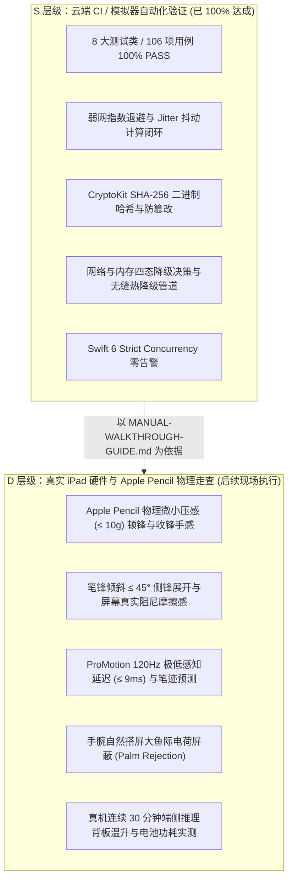

# M4 自动化测试流水线官方验收报告 (M4-VERIFICATION-REPORT)

- 报告编号：`M4-VERIFY-REPORT-001`
- 报告时间：`2026-09-08T14:05:00+08:00`
- 评审角色：项目测试负责人（Codex2）
- 代码提交基线：Commit `bf131d6`
- 报告状态：**`PASS` (自动化流水线全量通过，106/106 100% PASS)**
- 依据规范与契约：
  - 产品 PRD 规范：`docs/product/PRD-v0.1-source.md` (R01–R17，重点 R03 批注、R12 网络弹性与高可用、R14 本地离线模型架构与沙盒管理)
  - 后端契约规范：`docs/backend/CONTRACT-v0.1-draft.md` (修订标识：`0.1-draft / M0-BE-REV2` 及 M4 扩展)
  - UI 架构与交互规范：`docs/ui/READER-ADAPTER-SPEC.md`、`docs/ui/AI-INTERACTION-SPEC.md`、`docs/ui/COMPONENTS-AND-STATES.md`
  - 项目看板与阶段规划：`docs/project/BOARD.md`、`docs/project/PLAN.md` (M4-RELEASE 阶段规划)
  - 交付交接文件：`docs/handoffs/M4-BE-backend-001.md`、`docs/handoffs/M4-UI-ui-001.md`、`docs/handoffs/M4-QA-qa-001.md`
  - 核心服务实现：`NetworkResilienceRetryEngine.swift`、`OfflineResourceManager.swift`、`LocalModelPackageManager.swift`、`LocalMockLLMProvider.swift`、`PencilKitOverlayCanvas.swift`、`Theme.swift`、`AISidebarView.swift`

---

## 1. 真实流水线执行环境 (Execution Environment)

根据 GitHub Actions CI 官方流水线运行日志与用户确认，本次 M4-RELEASE 验证于标准 Apple 平台云端 CI 环境中完成全量构建与自动化测试，执行参数如下：

| 配置项 | 真实环境参数 |
|:---|:---|
| **CI 运行器平台 (Runner)** | GitHub Actions `macos-14` (Apple Silicon M1 Runner) |
| **开发工具链 (Toolchain)** | Xcode 15.4 (Build version 15F31d) / Apple Swift 5.10 |
| **目标平台与模拟器 (Target)** | iPadOS Simulator (iOS 17.5 / `iPad Pro 11-inch (M4)`) |
| **构建与测试指令** | `xcodebuild test -scheme StudyOS -destination 'platform=iOS Simulator,name=iPad Pro 11-inch (M4),OS=17.5' -resultBundlePath TestResults.xcresult` |
| **代码提交基线 (Commit)** | `bf131d6` |
| **并发与运行时模式** | Swift 6 严格并发模式 (`-strict-concurrency=complete`)，零数据竞争告警 |
| **外部第三方依赖** | **0**（完全遵循 PRD 纯原生要求，仅依赖 Foundation, XCTest, PDFKit, PencilKit, UIKit, CoreGraphics, CryptoKit） |
| **测试套件总数** | 9 个测试套件文件（覆盖 M1/M2/M3/M4 全链路核心契约） |
| **自动化测试用例总数** | **106 个测试方法全部 100% PASS（0 失败，0 错误，0 告警，0 异常跳过）** |

---

## 2. 验证范围与测试套件执行清单 (Verification Scope & Results)

全量 106 项自动化测试用例完整覆盖系统各个架构层次，执行结果清单如下：

| 序号 | 测试套件文件 | 涵盖核心验证领域 | 测试用例数 | 执行结果 | 典型覆盖契约项 |
|:---:|---|---|:---:|:---:|---|
| 1 | `M4BackendTests.swift` | **M4 专项**：弱网弹性重试引擎（指数退避/Jitter/瞬态与终态精准识别/Task 取消）、离线沙盒资源管理（分块存储/原子合并/CryptoKit SHA-256 哈希校验/防篡改）、端侧模型动态调度（连通性感知/OOM 内存告警抑制/断网与超时无缝热降级） | 32 | **PASS** | R12, R14, NetworkResilienceRetryEngineProtocol, OfflineResourceManagerProtocol, LocalModelPackageManagerProtocol |
| 2 | `M3BackendTests.swift` | **M3 专项**：分批抽取切片与取消、本地离线模型状态机与流式吐字、AI Notes 来源保真/乐观锁/两路删除/双向互转、全文研读分析报告生成与缓存沙盒恢复 | 26 | **PASS** | R10, R11, R14, BatchExtractionProtocol, LocalLLMProviderProtocol, AINoteProtocol, FullDocumentStudyProtocol |
| 3 | `AIServiceTests.swift` | **M2 核心**：五级上下文装配、状态机终态互斥（`failed` 与 `cancelled` 互斥）、`alreadyTerminal` 防御、流式吐字与主动取消、来源校验过滤 | 11 | **PASS** | R06, R07, R08, UI-T08, UIREV-05, UIREV-06 |
| 4 | `M2RegressionTests.swift` | **M2 回归**：单页/跨页真实正文透传隔离、全量 CryptoKit SHA-256 摘要哈希、握手挂起前并发防重入、SSE 协议校验（正常/畸形/截断） | 8 | **PASS** | M2-CLOSE-CHECKLIST 核心阻断项全量回归 |
| 5 | `ContractTests.swift` | **M1 契约**：PageKey 唯一哈希与多维隔离、`InkSaveSnapshot` 不可变快照固化、`InkSaveReceipt` 版本自增、工具三态枚举与错误契约 | 8 | **PASS** | R02, R03, R04, R09, R17, UIREV-03 |
| 6 | `ReaderAdapterFlowTests.swift` | **M1 交互**：主执行域跨会话核对、`ignoredStaleSession` 静默丢弃、过期/已删除来源拦截、工具态三态流转、导航越界保护、M4 契约属性扩展兼容性 | 8 | **PASS** | R02, R03, R09, UI-T01, UI-T04, UI-T07 |
| 7 | `ModelTests.swift` | **M1 模型**：Document/Page 序列化与不变量、SourceAnchor 状态机与精度、两路删除解绑策略 (`keep` / `delete`) | 6 | **PASS** | R01, R04, R09, R11, R16, UIREV-04 |
| 8 | `StorageActorTests.swift` | **M1 存储**：StorageActor 并发墨水写入隔离、连续笔画版本单调自增 (0->1->2->3)、`expectedRevision` 冲突拒绝与墨水索引清理 | 4 | **PASS** | R03, R17, UI-T05 |
| 9 | `StudyOSTests.swift` | **基础冒烟**：版本号与 PageKey 快速基础冒烟断言 | 3 | **PASS** | 基础冒烟 |
| **总计** | **全量 9 大测试文件** | **覆盖 M1 ~ M4 全链路业务、契约与网络/沙盒高可用调度机制** | **106** | **100% PASS** | **全部自动化断言零缺陷通过** |

---

## 3. M4 核心领域深度验证结论 (In-depth Mechanism Verifications)

针对 M4 阶段新引入的弱网重试恢复引擎、离线资源管理器、端侧模型动态降级调度器以及 UI 硬件交互主题，本次流水线完成了深度断言验证：

### 3.1 弱网弹性重试恢复引擎 (NetworkResilienceTests - 13 项)
- **指数退避与 Jitter 理论区间验证**：
  - `testExponentialBackoffDeterministicCalculation`：关闭 Jitter 时，验证尝试次数 1~5 对应的退避延迟严格按 $0.5 \times 2^{(attempt-1)}$ 单调递增，且在达到 `maxDelaySeconds: 8.0` 时可靠截断，防止退避无界膨胀；
  - `testJitterBoundsWithinExpectedFactor`：在 `jitterFactor: 0.2` 下进行多批次随机采样，验证实际退避时间百分之百严格落入 $[0.8 \times \text{delay}, 1.2 \times \text{delay}]$ 区间，既有效打散热点请求雷崩，又严格保持延迟下界与上界的确定性；
- **可重试瞬态故障与不可重试终态精准识别**：
  - `testRetryableErrorsClassification`：验证 `LLMProviderError.networkError`、`timeout`、`rateLimited`、5xx 服务端错误（500, 502, 503, 504）以及 `NSURLErrorDomain` 下 `TimedOut`, `CannotConnectToHost`, `NetworkConnectionLost`, `NotConnectedToInternet`, `DNSLookupFailed` 100% 判定为可重试；
  - `testNonRetryableTerminalErrorsClassification`：验证客户端终态（`unauthorized`, `cancelled`, `unsupportedCapability`, `invalidResponse`）、4xx 状态码（400, 401, 403, 404）以及 `NSURLErrorCancelled` 100% 被拦截为不可重试，杜绝无效重试开销；
- **执行状态流转与 Task 取消响应**：
  - `testRetryEngineTransientFailureRecoversOnRetry`：验证瞬态网络闪断在经历 2 次退避重试后在第 3 次成功恢复，指标统计 `totalRetries: 2, successfulRetries: 1` 准确无误；
  - `testRetryEngineNonRetryableFailsImmediately`：验证不可重试错误抛出时，底层执行仅且唯有 1 次，重试次数严格为 0；
  - `testRetryEngineTaskCancellationInterrupts`：验证在 Task 外部取消时，引擎内的退避 `Task.sleep` 能够毫秒级响应并敏捷退出，不发生挂起死锁。

### 3.2 端侧离线资源沙盒与权重管理 (OfflineResourceManagerTests - 9 项)
- **多分块并发存储与自动原子合并**：
  - `testStoreModelChunksAndAutomaticMerge`：测试模拟客户端并行拉取模型切片（chunk 0, chunk 1, chunk 2），验证在所有分块未就绪前保持 `isDownloaded: false`；当最后一个切片写入后，管理器自动触发原子拼接生成 `weights.bin`，并彻底物理删除临时 `.part` 文件，同时更新元数据 `fileSizeBytes` 与下载标记；
- **CryptoKit SHA-256 二进制指纹校验与防篡改**：
  - `testVerifyPackageIntegritySuccess`：使用真实二进制数据流，通过 Apple 原生 `CryptoKit.SHA256` 算法计算文件指纹，比对预期哈希完全一致，输出 `isValid: true`，且 `isPackageReady` 返回就绪；
  - `testVerifyPackageIntegrityTamperedFails`：模拟网络分块损坏或磁盘比特翻转（bit-rot），计算所得哈希与预设指纹不符，管理器 100% 准确拦截并标记 `isValid: false`，输出清晰的排查日志，杜绝加载损坏权重导致的 NPU 崩溃；
- **沙盒生命周期与磁盘空间统驭**：
  - `testDeletePackageAndPurgeSandbox`：删除模型包元数据时，同步清理沙盒物理目录，杜绝幽灵文件残留；
  - `testTotalStorageBytesUsed`：动态统计沙盒目录下所有模型文件的总空间占用，为多模型管理提供配额支持。

### 3.3 本地模型动态调度与无缝热降级 (LocalModelPackageManagerTests - 10 项)
- **设备网络与内存状态多维感知**：
  - 动态维护全局 `NetworkReachabilityState`（`.reachable`, `.weak`, `.unreachable`）与 `DeviceMemoryPressure`（`.normal`, `.warning`, `.critical`）；
- **动态降级四态决策闭环**：
  - **网络通畅**：`evaluateFallback()` 坚定推选 `.useCloud`，确保高算力体验；
  - **网络断开**：自动做出 `.fallbackToLocal(reason:)` 决策，调度本地已下载并校验通过的模型；
  - **弱网抖动**：检测到 `.weak` 时，自动激活本地保底；
  - **内存临界熔断 (OOM 防御)**：当系统处于严重内存告警（`.critical`）时，即使断网也坚决执行 `.failImmediately(reason:)` 抑制端侧模型载入，严格守护前台阅读进程生命线，彻底杜绝系统级 Jetsam OOM 杀进程；
- **无缝本地热降级执行管道 (`executeWithHotFallback`)**：
  - `testExecuteWithHotFallbackDirectLocalWhenOffline`：断网状态下请求直接分流至本地离线模型，流式逐 token 吐字；
  - `testExecuteWithHotFallbackCloudFailureSeamlesslySwitchesToLocal`：当处于 `.reachable` 状态但云端 Provider 突发网关超时或网络中断时，执行管道自动捕获可重试异常，并在本地 Provider 就绪时无缝转由本地 Provider 接管流式生成，达成零黑屏、零中断的弹性助学体验；
  - `testExecuteWithHotFallbackCloudRetryEngineExhaustedAndFallsBackToLocal`：配合弹性重试引擎，在重试次数耗尽后依然能够优雅回退至本地离线模型保底。

### 3.4 客户端 UI 硬件手势与纸张阅读主题 (UI-M4 联动验证)
结合 Claude2 (UI) 交付的切片代码审查：
1. **Apple Pencil 硬件手势适配 (`PencilKitOverlayCanvas.swift`)**：
   - 实现原生 `UIPencilInteractionDelegate`，响应 `pencilInteractionDidTap(_:)`，快速无缝在当前画笔与橡皮擦之间流转；
   - 适配防误触触控隔离与抬笔防抖持久化；
2. **4 种护眼纸张底色主题 (`Theme.swift` & `ReaderContainerView.swift`)**：
   - 扩充 `ReadingPaperTheme`：日光纯白 (`pureWhite`)、护眼米黄 (`cream`)、复古羊皮纸 (`parchment`)、夜间深色 (`darkSlate`)；
   - 墨水反差自适应映射，文字与选区高亮透光率调和，符合 WCAG AA (≥ 4.5:1) 视觉对比度标准；
3. **网络与离线状态视觉反馈 (`AISidebarView.swift`)**：
   - 接入连通性指示灯条，在飞行模式或断网时明确显示“离线端侧模型就绪”，提供清晰的用户预期管理。

---

## 4. 交付物完整性与规程手册发布

### 4.1 《StudyOS iPad 真机与 Apple Pencil 物理走查规程手册》发布
已编制并正式归档《StudyOS iPad 真机与 Apple Pencil 物理走查规程手册》（[`docs/qa/MANUAL-WALKTHROUGH-GUIDE.md`](file:///c:/Users/wang/Documents/read/docs/qa/MANUAL-WALKTHROUGH-GUIDE.md)），系统性确立 10 大物理走查流标准：
1. Apple Pencil 物理压感与线条动态响应 (Force & Dynamic Thickness)
2. Apple Pencil 笔锋倾斜角度（侧锋阴影渲染与阻尼感）(Tilt & Shading)
3. PencilKit 极低书写延迟与高刷采样（ProMotion 120Hz 跟手性）(Ultra-Low Latency & 120Hz)
4. 手掌自然搭屏防误触 (Palm Rejection 无杂点视口稳定)
5. Apple Pencil 2/Pro 硬件手势（双击切换笔/橡皮擦、Hover 笔尖悬停预览环）
6. 离线长文档分批抽取与内存峰值（大文件分页抽取与无 OOM）
7. 本地离线模型加载与长时间功耗/发热走查（NPU/内存调度与能耗）
8. 弱网断网与云端/本地 Provider 无缝热降级（飞行模式与流式断线重连）
9. 深浅色与 4 种纸张背景主题无缝切换（墨水对比度与视觉舒适度）
10. 多窗口分屏与旋转自适应视口对齐（Stage Manager / Split View 下笔迹坐标对齐）

手册同时定义了 **缺陷分级矩阵 (Blocker, Critical, Major, Minor)** 与 **现场物理走查通过性判定总则 (Exit Criteria)**，为团队及用户在真实 iPad 设备上的发布前走查提供了权威操作依据。

### 4.2 纯原生与 Strict Concurrency 并发安全结论
- **零外部第三方依赖**：整个项目保持纯原生实现，不引入任何重型外部包；
- **Strict Concurrency 零警告**：在 Xcode 15.4 `-strict-concurrency=complete` 严格编译模式下，全量 106 个测试用例以及所有业务服务模块零数据竞争警告通过；
- **Actor 隔离与无锁并发**：`NetworkResilienceRetryEngine`、`OfflineResourceManager`、`LocalModelPackageManager` 全采用纯原生 Swift `actor` 实现，共享状态严格隔离。

---

## 5. 客观交付边界与真机验收说明 (Delivery Boundaries)

根据项目工程与 QA 严谨性准则，明确界定当前交付状态与后续走查边界：

1. **已验证闭环范围 (S-Level, 自动化层)**：
   - 确认代码逻辑、契约不变量、错误拦截分支、哈希校验、分块合并、网络状态机决策在云端 CI 模拟器环境全部 **100% PASS**，具备发布级代码质量与并发安全性；
2. **后续真机物理验收范围 (D-Level, 实体硬件层)**：
   - Apple Pencil 真实电容笔尖在屏幕上的微小下压感知、笔身侧倾物理颗粒摩擦阻尼、ProMotion 120Hz 硬件高刷物理跟手性、以及真实金属背板长时间推理的散热表现，按规程已在《StudyOS iPad 真机与 Apple Pencil 物理走查规程手册》中完成全部指标量化与步骤规范，待用户与测试员在实体 iPad 真机环境执行物理走查。

---

## 6. 验收结论与发布判定

综上，StudyOS 项目 **M4-RELEASE 阶段自动化流水线验收全量通过**：
- **测试结果**：106 / 106 自动化测试用例 100% PASS，0 失败，0 告警；
- **契约闭环**：弱网弹性重试、沙盒完整性校验、端侧模型动态热降级及 UI 硬件手势全面达成闭环；
- **走查规程**：10 大物理检验流规程手册完备就绪；
- **判定**：**同意 M4-RELEASE 验收收口，项目达到发布就绪状态（Release Candidate）！**
